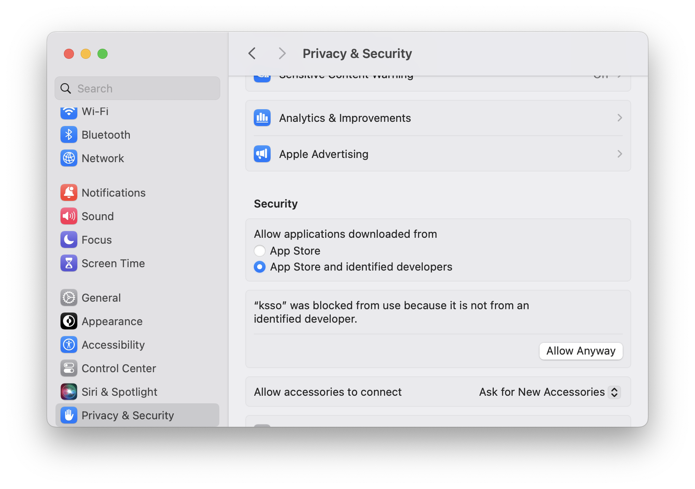
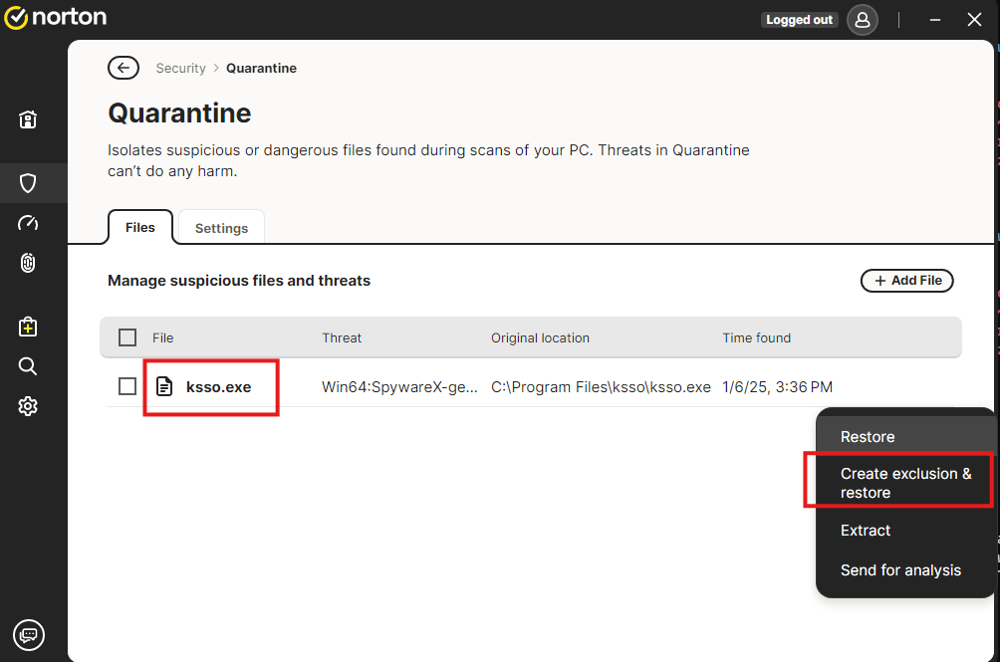

# KSSO

Keycloak AWS OIDC IAM SSO Helper

A simple console tool to authenticate into AWS via OIDC using [credential_process](https://docs.aws.amazon.com/cli/v1/userguide/cli-configure-sourcing-external.html), supported by tools like [aws-vault](https://github.com/99designs/aws-vault/blob/master/USAGE.md#using-credential_process).

## Features

- Connects to Keycloak to obtain an OIDC `id_token`.
- Calls `sts:assume_role_with_web_identity` with the token.
- Outputs AWS IAM short-term credentials as JSON or environment variables.

### Example Usage

```sh
ksso \
    --json \
    --client-id aws-devops \
    --aws-role-arn arn:aws:iam::111222333444:role/prod-keycloak-sso-administrators-role

{
    "AccessKeyId": "HIDDEN",
    "SecretAccessKey": "HIDDEN",
    "SessionToken": "HIDDEN",
    "Expiration": "2025-01-07T00:24:52+00:00"
}
```

## Configuration

### Step 1: Create a Config File

Create a `~/.ksso_config.toml` file with the following content:

```toml
[sso]
sso_domain = "https://keycloak.site.com"
sso_realm = "master"
sso_agent_port = 8201
```

> Ensure the Keycloak client allows redirects to the specified `sso_agent_port` on `localhost`.

### Step 2: Define AWS Profiles

Update your `~/.aws/config` file to include profiles for your Keycloak roles:

```ini
[profile keycloak/administrators]
region = us-west-2
credential_process = ksso --json --client-id aws-devops --aws-role-arn arn:aws:iam::111222333444:role/prod-keycloak-sso-administrators-role

[profile keycloak/developers]
region = us-west-2
credential_process = ksso --json --client-id aws-developers --aws-role-arn arn:aws:iam::111222333444:role/prod-keycloak-sso-developers-role
```

if you want to support multiple keycloak instances, you will need to create a separate config file for each instance and pass the path to the config file using the `--config` flag.

```ini
[profile keycloak-2/developers]
region=us-east-1
credential_process=/usr/local/bin/ksso --config /home/dmitry/.keycloak_2_ksso_config.toml --json --client-id aws-devops --aws-role-arn arn:aws:iam::333444555666:role/prod-keycloak-sso-developers-role
```

## Use

### Retrieve AWS IAM Shell Credentials

```sh
aws-vault exec keycloak/administrators
aws s3 ls
```

### Access AWS Console

```sh
aws-vault login keycloak/administrators
```

## Prerequisites

### Keycloak Configuration

- A Keycloak client must be created with:
  - Valid redirect URLs matching `~/.ksso_config.toml`.
  - Roles named with the full ARN of the AWS IAM Role to assume.
  - The `roles` scope added to the client.

### AWS Setup

- An AWS OIDC identity provider linked to your Keycloak instance.
- IAM roles with trust policies for the appropriate Keycloak client audiences.

### aws-vault

Install [aws-vault](https://github.com/99designs/aws-vault/tree/master?tab=readme-ov-file#installing) or another tool supporting `credential_process`.

## Installation

### Linux

```sh
sudo curl -L https://github.com/saritasa-nest/ksso/releases/download/v0.1.0/ksso-linux-0.1.0 -o /usr/local/bin/ksso \
  && sudo chmod +x /usr/local/bin/ksso
```

### macOS

```sh
sudo curl -L https://github.com/saritasa-nest/ksso/releases/download/v0.1.0/ksso-macos-arm64 -o /usr/local/bin/ksso \
  && sudo chmod +x /usr/local/bin/ksso
```

On the first run, you must enable the app under **Settings > Privacy & Security** as shown below:


### Windows

Run the following commands in an Administrator PowerShell:

```sh
Set-ExecutionPolicy RemoteSigned
$url = "https://github.com/saritasa-nest/ksso/releases/download/v0.1.0/ksso-windows-x64.exe"
$output = "$env:USERPROFILE\Downloads\ksso-windows-x64.exe"
Invoke-WebRequest -Uri $url -OutFile $output

$installPath = "C:\Program Files\ksso"
New-Item -ItemType Directory -Path $installPath
Move-Item -Path "$output" -Destination "$installPath\ksso.exe"
dir "$installPath"
```

Add the KSSO folder to your PATH:

```sh
[System.Environment]::SetEnvironmentVariable(
    "PATH",
    [System.Environment]::GetEnvironmentVariable("PATH", "Machine") + ";C:\Program Files\ksso",
    "Machine"
)
[System.Environment]::GetEnvironmentVariable("PATH", "Machine") -split ";"
```

Antivirus software may flag the executable due to the bundling process. Add the file to exceptions if necessary


## Local Development

### Requirements

- Python 3.12 (recommended: install via `pyenv`)
- Poetry

### Setup

1. Create a virtual environment:

   ```sh
   python -m venv myenv
   source myenv/bin/activate
   ```

2. Install dependencies:

   ```sh
   poetry install
   ```

3. Run the tool:

   ```sh
   poetry run python ksso/main.py \
       --json \
       --client-id aws-devops \
       --aws-role-arn arn:aws:iam::111222333444:role/prod-keycloak-sso-administrators-role
   ```

4. Compile binary

   ```sh
   poetry run nuitka \
       --onefile \
       --include-data-file=ksso/failure_access_prohibited_message.html=ksso/failure_access_prohibited_message.html \
       --include-data-file=ksso/success_message.html=ksso/success_message.html \
       --output-dir="dist" \
       --output-filename=ksso \
       ksso/main.py
   ```

## Debugging

### On Linux/macOS

```sh
export DEBUG=1
```

### On Windows

```sh
$env:DEBUG = "1"
```

## Roadmap

- Use Nuitka commercial to eliminate antivirus alarms on Windows.
- Implement Apple code signing for macOS distribution.

### Additional Resources

- [Nuitka Issue #2611](https://github.com/Nuitka/Nuitka/issues/2611)
- [Nuitka Issue #3239](https://github.com/Nuitka/Nuitka/issues/3239)
